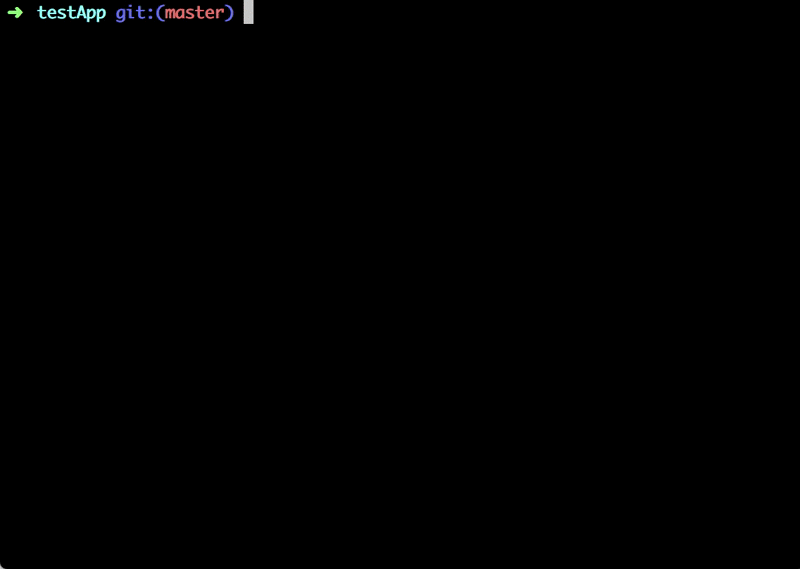

# serviceless

**Serviceless** - cli tool on top of Serverless framework, that simplifies workflow with multiple services.

[](https://circleci.com/gh/8bites/serviceless) [](https://codecov.io/gh/8bites/serviceless)
[](https://badge.fury.io/js/serviceless)
[](https://opensource.org/licenses/MIT)

# Quick start



1. Install serverless framework

```sh
npm install serverless -g
```

2. Install serviceless cli

```sh
npm install serviceless -g
```

3. Deploy

```sh
slx deploy all
```

# How to

## Deploy

#### Deploy all services in a folder

```sh
slx deploy all
```

#### Deploy service with command line prompt

```sh
slx deploy
```

then select service or folder from the list.

#### Deploy service, matching string

```sh
slx deploy <query>
```

### Deploy with cli options

Every serverless option that you set will be propagated to the `sls deploy` command accordingly:

```sh
slx deploy all --stage prod --region eu-central-1
```

will deploy to `prod` stage and `eu-central-1` region.

### Deploy with environment variables

slx will share all enviroment variables with serverless process, so

```sh
MY_SECRET=foo slx deploy all
```

will be injected into serverless config.

### Deploy Flags

`-b`, `--runInBand` - deploy services one by one (parallel by default)

`-e`, `--exitOnFailure` - stop deployment of other services on failure

`-r`, `--rollbackOnFailure` - rollback services on deployment failure
Makes sense to spar with `--exitOnFailure` flag to stop on failure and rollback.

`-v`, `--verbose` - show serverless output

## Help

```sh
slx --help
slx deploy --help
```

# What's next

* [x] add option to rollback to previous state on fail
* [ ] aggregate logs for multiple services
* [ ] add configuration file to deploy in band services that rely on each other
* [ ] save and restore `.serverless` folders to use as deployment artifacts for CI/CD tools

# Contributions

Yes, please!

Clone repo, then

```sh
npm install
npm test
```

# LICENCE

MIT @ [Pavel Vlasov](https://github.com/pavelvlasov)
